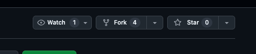
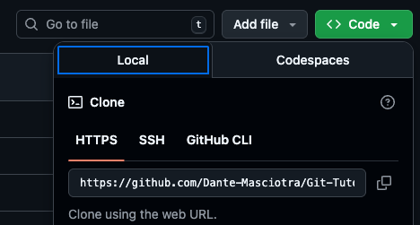
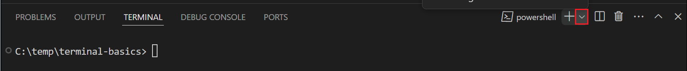
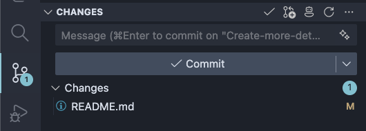
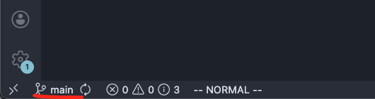
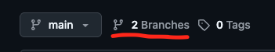

# Tutorial

## Part 1

#### First we are going to create your own github fork and update it from your PC

1. Click the fork button and create a fork of this repo
    
2. On your fork, click the green button labeled code, and copy the https link that appears. Should look similar to this `https://github.com/Dante-Masciotra/Git-Tutorial.git`
    
3. Create a new folder and open it in VS code
4. Inside the VS code terminal type `git clone <your link from github>` which should look similar to this `git clone https://github.com/Dante-Masciotra/Git-Tutorial.git`
    
5. Open VS code again inside the folder that was created from running git clone

- This will pull down a copy of this project onto your pc

6. Edit a line to the `README.md` file saying who you are and something interesting about you

7. Use the `git add .`, `git commit -m 'your message'`, and `git push` to add your changes to GitHub
    OR
    Use the Source Control in VS code to stage, commit, and push your changes
    

- Now if you go back to your fork on github, you should see it updated with your changes.

## Part 2

#### Second we are going to create a branch and push it to our fork

1. Go back to your vscode with your project open. In the bottom left corner it will tell you which branch you are in. Currently it should be main
    
2. In your terminal, create a new branch using `git checkout -b "first-branch"`. Now in the bottom left corner it should say the name of your new branch
    
3. Inside your new branch your are going to edit a sentence saying another interesting fact about yourself (if there is only one interesting about you then lie)
4. Use the `git add .`, `git commit -m 'your message'`, and `git push` to push your branch to GitHub
    OR
    Use the Source Control in VS code to stage, commit, and push your changes
    
5. Now if you did everything correctly, navigate to your fork on github and click on branches, you should now see main as well as the new branch you just pushed
    

## Part 3

#### Learn how to merge your branches into main

1. Go back to your vscode and type `git branch`. This will show you all of your branches in your project.
2. Type `git checkout "main"` to move back to your main branch. It should say main in the bottom left corner.
3. Type `git checkout -b "second-branch` to create a new branch.
4. Inside your new branch you're going to edit the exact same sentence as you did in part 2 with a third fact about yourself <b>Make sure its the same line</b>
5. Use the `git add .`, `git commit -m 'your message'` to save a commit of your changes
    OR
    Use the Source Control in VS code to stage, commit your changes
    

- Note, at this point we should now have 3 branches. `main`, `first-branch`, and `second-branch`.

6. Now we are going to move the changes we made in `first-branch` into `main`. In the VS code terminal type `git checkout "main"` to move back to your main branch. Check the bottom left again to make sure it says main.
7. Next, type `git merge "first-branch"`. This will take the changes from `first-branch` and put them into `main`. `main` should now look exactly the same as `first-branch`.
8. Now, try to type `git merge "second-branch"`. This should give an error because `first-branch` and `second-branch` both have changed the same line. So git is not sure which version is correct.
9. I want you to click the file that says it has merge conflict and read it. I want you to keep either the second or third fact about yourself but not both. Then when the file looks good, continue.
10. Finally, use the `git add .`, `git commit -m 'your message'`, and `git push` to push your new `main` branch to GitHub
     OR
     Use the Source Control in VS code to stage, commit, and push your changes
     

- Now, on your github fork, you should see two facts about yourself. Congrats, this should cover the basics of git and GitHub
