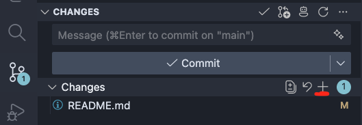
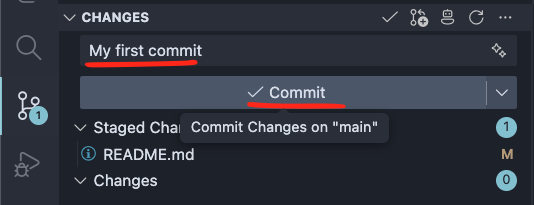
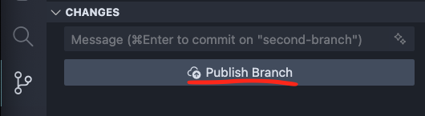
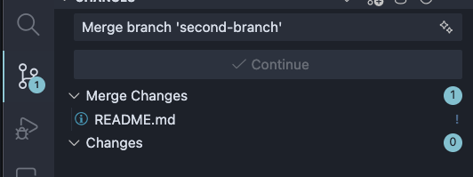
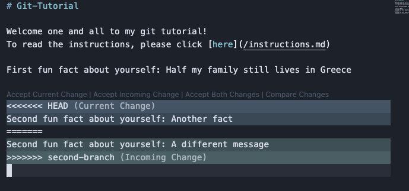
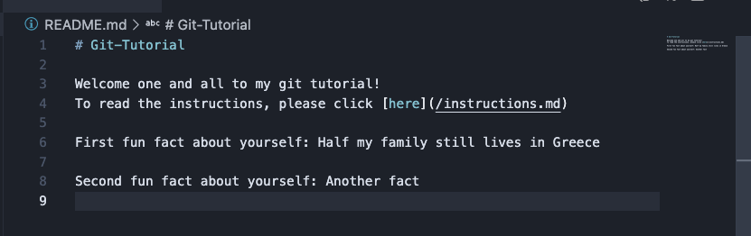
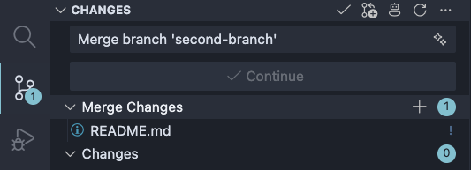

# Tutorial

## Part 1

#### First we are going to create your own github fork and update it from your PC

1. Click the fork button and create a fork of this repo
    
2. On your fork, click the green button labeled code, and copy the https link that appears. Should look similar to this `https://github.com/Dante-Masciotra/Git-Tutorial.git`
    
3. Create a new folder and open it in vscode
4. Open the vscode terminal (use ctrl j, or command j to open it). Inside the terminal type `git clone <your link from github>` and enter. Your command should look similar to this `git clone https://github.com/Dante-Masciotra/Git-Tutorial.git`
    
5. Close vscode and open it again inside the folder named Git-Tutorial which was just made from running git clone

- The Git-Tutorial folder is a copy of your fork on GitHub

6. Add a fun fact about yourself to the line marked `First fun fact about yourself:` in the README.md file on vscode. Don't forget to save your changes. (use ctrl s or command s)
7. Open source control by clicking the button on the left sidebar in the image below
    
8. Use the `git add .`, `git commit -m 'your message'`, and `git push` to add your changes to GitHub
    OR
    Use the Source Control in vscode to stage, commit, and push your changes
    To use Source Control follow the images below. Press the plus button next to changes to stage your changes. Type your message and click commit to create a commit. Click Sync Changes to push your changes onto github.
    

- Now if you go back to your fork on GitHub, you should see it updated with your changes. Congrats, you made your first commit and pushed it to GitHub

## Part 2

#### Next, we are going to create a branch and push it to our fork

1. Go back to your vscode with your project open. In the bottom left corner it will tell you which branch you are in. Currently it should be main
    
2. In your terminal, create a new branch using `git checkout -b "first-branch"`. Now in the bottom left corner it should say the name of your new branch
    
3. Inside your new branch your are going to add to the sentence `Second fun fact about yourself:` saying another interesting fact about yourself (if there is only one interesting about you then lie)
4. Use `git add .`, `git commit -m 'your message'`, and `git push --set-upstream origin first-branch` to push your branch to GitHub
    OR
    Use the Source Control in vscode to stage, commit, and push your changes
    Use the images from Part 1 step 8 to do this. Don't forge to click Publish Branch after clicking commit.
    

5. Now if you did everything correctly, navigate to your fork on GitHub and click on branches, you should now see main as well as the new branch you just pushed
    

## Part 3

#### Learn how to merge your branches into main

1. Go back to your vscode and type `git branch` into your terminal. This will show you all of your branches in your project.
2. Type `git checkout "main"` to move back to your main branch. It should say main in the bottom left corner.
3. Type `git checkout -b "second-branch"` into the vscode terminal to create a new branch.
4. Inside your new branch you're going to edit the exact same sentence as you did in part 2 with a third fact about yourself <b>Make sure its the same line</b>
5. Use the `git add .`, `git commit -m 'your message'` to save a commit of your changes
    OR
    Use the Source Control in vscode to stage, commit your changes
    

- Note, at this point we should now have 3 branches. `main`, `first-branch`, and `second-branch`. Try typing `git branch` in the terminal to confirm

6. Now we are going to move the changes we made in `first-branch` into `main`. In the vscode terminal type `git checkout "main"` to move back to your main branch. Check the bottom left again to make sure it says main.
7. Next, type `git merge "first-branch"`. This will take the changes from `first-branch` and put them into `main`. `main` should now look exactly the same as `first-branch`.
8. Now, try to type `git merge "second-branch"`. This should give an error because `first-branch` and `second-branch` both have changed the same line. So git is not sure which version is correct. Notice the file should appear in Source Control under merge changes.
    
9. I want you to click the file that says it has merge conflict and read it. I want you to keep either the second or third fact about yourself but not both. Then when the file looks good, continue. The first image below shows what a merge conflict looks like. The second image below is what is should look like after I edit the issue out and keep what I want.
    
    
10. Finally, use the `git add .`, `git commit -m 'your message'`, and `git push` to push your new `main` branch to GitHub
     OR
     Use the Source Control in vscode to stage, commit, and push your changes
     Notice in the image below, I click the plus next to Merge Changes after I have resolved the merge conflict.
     

- Now, on your github fork, you should see two facts about yourself. Congrats, this should cover the basics of git and GitHub
