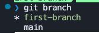

# Tutorial

## Part 1

#### First we are going to create your own GitHub fork and update it from your PC

1. Click the fork button and create a fork of this repo.
    
2. On your fork, click the green button labeled **Code**, and copy the HTTPS link that appears. It should look similar to this: `https://github.com/Dante-Masciotra/Git-Tutorial.git`
    
3. Create a new folder and open it in VS Code.
4. Open the VS Code terminal (use **Ctrl + J** or **Cmd + J** to open it). Inside the terminal type `git clone <your link from github>` and press Enter. Your command should look similar to: `git clone https://github.com/Dante-Masciotra/Git-Tutorial.git`
    
5. Close VS Code and open it again inside the folder named **Git-Tutorial**, which was just created from running `git clone`.

- The Git-Tutorial folder is a copy of your fork on GitHub.

6. Add a fun fact about yourself to the line marked `First fun fact about yourself:` in the **README.md** file in VS Code. Don't forget to save your changes (use **Ctrl + S** or **Cmd + S**).
7. Open Source Control by clicking the button on the left sidebar.
    
8. Use `git add .`, `git commit -m 'your message'`, and `git push` to add your changes to GitHub.
    OR
    Use Source Control in VS Code to stage, commit, and push your changes.
    To use Source Control, follow the images below. Press the plus button next to _Changes_ to stage your changes. Type your message and click _Commit_ to create a commit. Click _Sync Changes_ to push your changes to GitHub.
    

- Now if you go back to your fork on GitHub, you should see it updated with your changes. Congrats, you made your first commit and pushed it to GitHub!

## Part 2

#### Next, we are going to create a branch and push it to our fork

1. Go back to VS Code with your project open. In the bottom left corner, it will tell you which branch you are currently in — it should say **main**.
    

2. In your terminal, create a new branch using `git checkout -b "first-branch"`. Now in the bottom left corner it should show the name of your new branch.
    

3. Inside your new branch, you are going to add to the sentence `Second fun fact about yourself:` by adding another interesting fact about yourself (if there is only one interesting thing about you, then lie).

4. Use `git add .`, `git commit -m 'your message'`, and `git push --set-upstream origin first-branch` to push your branch to GitHub.
    OR
    Use Source Control in VS Code to stage, commit, and push your changes.
    Use the images from Part 1, Step 8. Don’t forget to click **Publish Branch** after committing.
    

5. Now, if you did everything correctly, navigate to your fork on GitHub and click on **Branches**. You should now see **main** as well as the new branch you just pushed.
    

## Part 3

#### Learn how to merge your branches into main

1. Go back to VS Code and type `git branch` into your terminal. This will show you all of your branches in your project.
    
2. Type `git checkout "main"` to move back to your main branch. It should say **main** in the bottom left corner.
3. Type `git checkout -b "second-branch"` into the VS Code terminal to create a new branch.
4. Inside your new branch you're going to edit the exact same sentence as you did in Part 2 by adding a different second fun fact about yourself. **Make sure it's on the same line.**
5. Use `git add .` and `git commit -m 'your message'` to save a commit of your changes.  OR
    Use Source Control in VS Code to stage and commit your changes. See part 1 step 8 to do this but remember to skip the push step here.
    

- At this point, you should have 3 branches: `main`, `first-branch`, and `second-branch`. Try typing `git branch` to confirm.

6. Now we are going to move the changes we made in `first-branch` into `main`. In the VS Code terminal, type `git checkout "main"` to move back to your main branch. Check the bottom left again to make sure it says **main**.
7. Next, type `git merge "first-branch"`. This will take the changes from `first-branch` and put them into `main`. `main` should now look exactly the same as `first-branch`.
8. Now type `git merge "second-branch"`. This should give an error because `first-branch` and `second-branch` both changed the same line, so Git is not sure which version is correct. Notice the file should appear in Source Control under **Merge Changes**.
    
9. Click the file that has a merge conflict and read it. Choose whether to keep the second or third fact about yourself — but not both. Then edit the file so that the conflict markers are gone. The first image below shows what a merge conflict looks like. The second image shows what it should look like after you fix it.
    
    
10. Finally, use `git add .`, `git commit -m 'your message'`, and `git push` to push your updated `main` branch to GitHub.  OR  Use Source Control in VS Code to stage, commit, and push your changes.  Notice in the image below that you click the plus next to **Merge Changes** after resolving the conflict.
     

- Now, on your GitHub fork, you should see two facts about yourself. Congrats — this should cover the basics of Git and GitHub!
